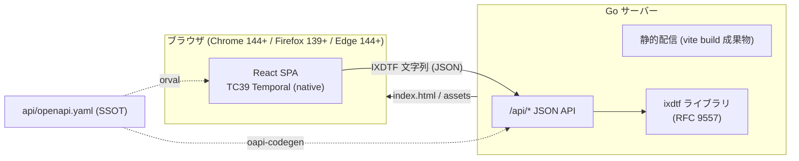
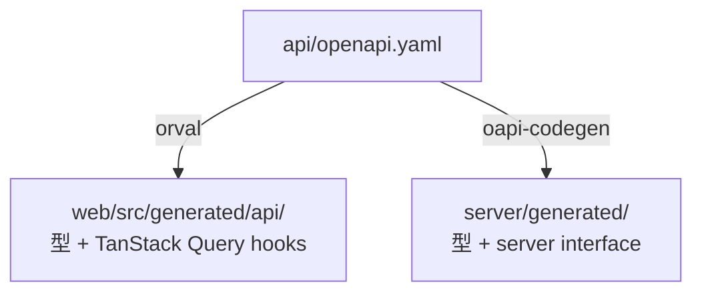
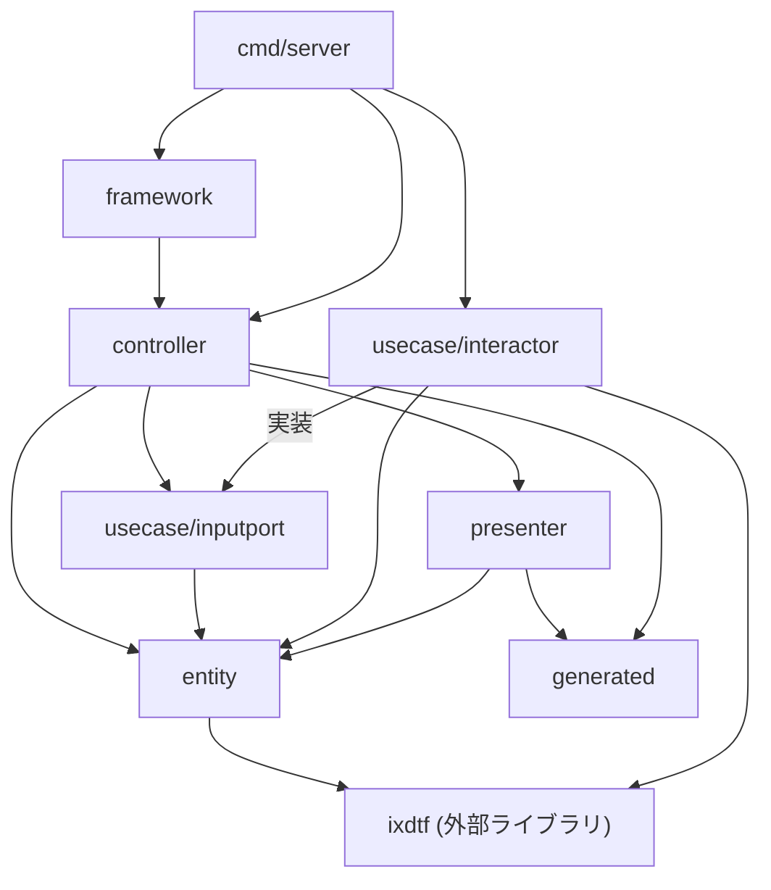
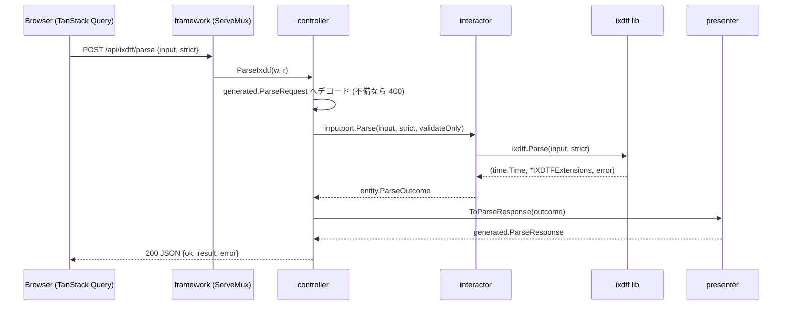

# IXDTF デモアプリケーション 設計書

機能要件は [requirements.md](./requirements.md) を参照。

## 技術スタック

| 領域            | 技術                                                                 |
| ------------- | ------------------------------------------------------------------ |
| バックエンド        | Go (net/http 標準ルーター) + [ixdtf](https://github.com/8beeeaaat/ixdtf) |
| フロントエンド       | React + Vite + TypeScript                                          |
| 日時処理 (ブラウザ)   | TC39 Temporal API (ネイティブ / temporal-polyfill を実行時に切替可能)             |
| API 契約        | OpenAPI 3.1 (SSOT) → Orval (TS) / oapi-codegen (Go)                |
| データ取得         | TanStack Query (Orval 生成 hooks)                                    |
| フォーム          | TanStack Form                                                      |
| ルーティング        | TanStack Router (型付き search params を F-2-7 の共有 URL に利用)            |
| スタイリング        | Tailwind CSS v4 (@tailwindcss/vite)                                |
| i18n          | react-i18next (ja / en)                                            |
| Lint / Format | Biome (web)、golangci-lint (server)                                 |
| テスト           | Vitest、Storybook、Go table-driven tests                             |

## システム構成



デモの核は「**同じ IXDTF 文字列が、ブラウザのネイティブ Temporal と Go の ixdtf という
独立した 2 実装の間を行き来する**」こと。API ペイロードの日時値は常に IXDTF / RFC 3339
文字列または `unix_nano` (10 進文字列) で運び、両側で解析・整形する。

## リポジトリ構成 (モノレポ)

デモは Go ixdtf ライブラリのリポジトリ ([8beeeaaat/ixdtf](https://github.com/8beeeaaat/ixdtf)) の
`demo/` 配下に置く (D-14)。以下のパスはすべて `demo/` 基準。

```text
demo/                        # ライブラリ本体 (module github.com/8beeeaaat/ixdtf) はリポジトリルート
├─ go.mod                    # フェンス専用 (Go ソースなし)。demo/ をライブラリのモジュール zip と ./... から除外
├─ api/
│   └─ openapi.yaml          # API 契約の SSOT
├─ server/                   # Go バックエンド (Clean Architecture ライト)
│   ├─ go.mod                # module github.com/8beeeaaat/ixdtf/demo/server
│   ├─ cmd/server/main.go    # composition root (単一バイナリ)
│   ├─ cmd/worker/main.go    # composition root (Cloudflare Workers / WASM)
│   ├─ entity/
│   ├─ usecase/
│   │   ├─ inputport/
│   │   └─ interactor/
│   ├─ presenter/
│   ├─ controller/
│   ├─ framework/
│   └─ generated/            # oapi-codegen 出力 (git 管理)
├─ web/                      # React フロントエンド
│   ├─ orval.config.ts
│   └─ src/
├─ docs/
│   ├─ requirements.md
│   ├─ architecture.md
│   └─ DESIGN.md             # UI デザインシステム
├─ Makefile                  # generate / dev / test / lint / build / deploy
└─ wrangler.jsonc            # Cloudflare Workers デプロイ設定
```

## スキーマ駆動開発

`api/openapi.yaml` を唯一の契約とし、両言語の型を生成する。手書きの API 型は禁止。



- OpenAPI 3.1 記法に従う: nullable は `type: ["string", "null"]`、レスポンスに `description: "OK"` 必須
- oapi-codegen は 3.1 未対応のため、`make generate-server` 内で `openapi-down-convert` により
  3.0 中間ファイル (`server/openapi-3.0.gen.yaml`、git 管理外) へ変換してから生成する。SSOT は 3.1 のまま
- 生成物は git 管理し、CI で `make generate` 後の `git diff --exit-code` により乖離を検出する

## API 設計

エンドポイントは 4 つ。解析失敗は **HTTP 200 のドメイン結果** (`ok: false`) として返す
(要件 A-1: 不正な文字列を試すことがこのアプリの正常系のため)。4xx はリクエスト自体の不備のみ。

### スキーマ定義 (openapi.yaml 抜粋)

```yaml
openapi: 3.1.0
info:
  title: IXDTF Demo API
  version: 0.1.0
paths:
  /api/ixdtf/parse:
    post:
      operationId: parseIxdtf
      requestBody:
        required: true
        content:
          application/json:
            schema: { $ref: "#/components/schemas/ParseRequest" }
      responses:
        "200":
          description: "OK"
          content:
            application/json:
              schema: { $ref: "#/components/schemas/ParseResponse" }
        "400":
          description: "OK"
          content:
            application/json:
              schema: { $ref: "#/components/schemas/BadRequestError" }
  /api/ixdtf/format:
    post:
      operationId: formatIxdtf
      # FormatRequest → FormatResponse (構造は下記 components 参照)
  /api/ixdtf/roundtrip:
    post:
      operationId: roundtripIxdtf
      # RoundtripRequest → RoundtripResponse
  /api/now:
    get:
      operationId: getNow
      parameters:
        - { name: time_zone, in: query, schema: { type: string } }
        - { name: calendar,  in: query, schema: { type: string } }
      # → NowResponse

components:
  schemas:
    ParseRequest:
      type: object
      required: [input, strict]
      properties:
        input:  { type: string }
        strict: { type: boolean }
        validate_only: { type: boolean, default: false }   # F-2-6
    ExtensionTag:
      type: object
      required: [key, value, critical]
      properties:
        key:      { type: string }        # 例: "u-ca"
        value:    { type: string }        # 例: "japanese"
        critical: { type: boolean }       # "!" フラグ
    ParseResult:
      type: object
      required: [rfc3339, unix_nano, offset_seconds, time_zone, time_zone_critical, tags]
      properties:
        rfc3339:            { type: string }               # RFC3339Nano 表記
        unix_nano:          { type: string }               # int64 の 10 進文字列 (JS 精度対策)
        offset_seconds:     { type: integer }
        time_zone:          { type: ["string", "null"] }   # 例: "Asia/Tokyo"
        time_zone_critical: { type: boolean }
        tags:
          type: array
          items: { $ref: "#/components/schemas/ExtensionTag" }
    ParseError:
      type: object
      required: [message]
      properties:
        message: { type: string }   # ixdtf ライブラリのエラー原文 (要件 A-3)
    # result / error は optional ($ref) で表現する。oneOf [$ref, null] は
    # oapi-codegen (3.0 down-convert 経由) が変換できないため。
    # 「成功時のみ result、失敗時のみ error」のセマンティクスは ok フラグが担う (D-1)。
    ParseResponse:
      type: object
      required: [ok]
      properties:
        ok:     { type: boolean }
        result: { $ref: "#/components/schemas/ParseResult" }   # 成功時のみ
        error:  { $ref: "#/components/schemas/ParseError" }    # 失敗時のみ
    FormatRequest:
      type: object
      required: [unix_nano, extensions]
      properties:
        unix_nano: { type: string }
        extensions:
          type: object
          required: [time_zone, time_zone_critical, tags]
          properties:
            time_zone:          { type: ["string", "null"] }
            time_zone_critical: { type: boolean }
            tags:
              type: array
              items: { $ref: "#/components/schemas/ExtensionTag" }
    FormatResponse:
      type: object
      required: [ok, ixdtf]
      properties:
        ok:    { type: boolean }
        ixdtf: { type: ["string", "null"] }
        error: { $ref: "#/components/schemas/ParseError" }   # 失敗時のみ
    RoundtripRequest:
      type: object
      required: [input, strict]
      properties:
        input:  { type: string }
        strict: { type: boolean }
    RoundtripResponse:
      type: object
      required: [parse, formatted, lossless]
      properties:
        parse:     { $ref: "#/components/schemas/ParseResponse" }
        formatted: { type: ["string", "null"] }   # Parse 成功時のみ FormatNano の結果
        lossless:  { type: ["boolean", "null"] }  # formatted == input
    NowResponse:
      type: object
      required: [ixdtf, unix_nano]
      properties:
        ixdtf:     { type: string }
        unix_nano: { type: string }
    BadRequestError:
      type: object
      required: [message]
      properties:
        message: { type: string }
```

## Go サーバー設計 (Clean Architecture ライト)

DB を持たないため `model/` と `gateway/` は**設けない** (永続化が必要になった時点で追加する)。
ixdtf ライブラリはドメインロジックの中核として **interactor と entity からのみ**利用する。

### レイヤーと責務

| レイヤー               | パッケージ                       | 責務                                                                                                    |
| ------------------ | --------------------------- | ----------------------------------------------------------------------------------------------------- |
| entity             | `server/entity`             | ドメイン型 (`ParseOutcome`, `Extensions`, `ExtensionTag` 等)。ixdtf の型 (`*ixdtf.IXDTFExtensions`) との双方向変換を持つ |
| usecase/inputport  | `server/usecase/inputport`  | `IxdtfInputPort` インターフェース (controller が依存する契約)                                                        |
| usecase/interactor | `server/usecase/interactor` | `ixdtf.Parse` / `FormatNano` の呼び出しとドメイン判断 (strict、validate_only、lossless 判定)                          |
| presenter          | `server/presenter`          | entity → generated レスポンス型への変換 (unix_nano の文字列化等)                                                      |
| controller         | `server/controller`         | HTTP ハンドラ。JSON デコード → inputport 呼び出し → presenter → JSON エンコード                                         |
| framework          | `server/framework`          | `http.ServeMux` ルーティング + 静的ファイル配信 (`go:embed` した vite build 成果物)。API ルート定義は `framework/api` サブパッケージ (Workers エントリポイントと共有、dist を embed しない) |
| generated          | `server/generated`          | oapi-codegen 出力 (リクエスト / レスポンス型)                                                                      |
| composition root   | `server/cmd/server`, `server/cmd/worker` | interactor 生成 → controller へ注入 → 起動。`cmd/server` は framework 全体 (単一バイナリ)、`cmd/worker` は `framework/api` のみ (Cloudflare Workers / WASM) |

### 依存方向



### インターフェース定義 (inputport)

```go
// server/usecase/inputport/ixdtf.go
type IxdtfInputPort interface {
    Parse(input string, strict bool, validateOnly bool) entity.ParseOutcome
    Format(unixNano int64, ext entity.Extensions) entity.FormatOutcome
    Roundtrip(input string, strict bool) entity.RoundtripOutcome
    Now(timeZone string, calendar string) (entity.FormattedNow, error)
}
```

解析失敗は `ParseOutcome.Err` に保持する (Go の `error` 戻り値にしない)。
ドメイン上の正常系だからであり、controller が 200/4xx を選り分ける分岐を持たずに済む。

### リクエスト処理フロー (parse の例)



## フロントエンド設計

### ディレクトリ構成

```text
web/src/
├─ main.tsx                  # Providers → TemporalProvider (native/polyfill 切替) → Router
├─ index.css                 # Tailwind エントリ (@import "tailwindcss" + @theme トークン)
├─ app/
│   ├─ router.tsx            # TanStack Router (5 メインルート + support。/interop → /playground?mode=roundtrip、/temporal-lab → /playground?mode=lab へリダイレクト)
│   ├─ providers.tsx         # QueryClient / i18n / theme
│   └─ i18n.ts
├─ pages/
│   ├─ home/                 # F-1: ClockCard, IxdtfDisplay, MonthCalendar, ServerNowCard
│   ├─ playground/           # F-2/F-3/F-6: ワークベンチ = 解析・検証 / 往復比較 / Temporal ラボ の 3 モード。実装は workbench/ (解析・往復は入力共有、Lab は temporal-lab/ の固定 fixture)
│   ├─ interop/              # F-3: ↑ ワークベンチの往復比較モードへ統合 (ComparisonTable / PresetList を内包)
│   ├─ converter/            # F-4: WorldClockList, TimeZoneAdder, CalendarSwitch
│   ├─ guide/                # F-5: GuideContent, SampleGallery
│   ├─ temporal-lab/         # F-6: ワークベンチ Lab モードの実体 (LabPanel + DstOverlap / ZoneArithmetic / CalendarProjection 実験)
│   └─ about/                # F-7: Temporal / IXDTF それぞれの解説と関係性 (静的コンテンツ)
├─ components/               # 横断: IxdtfHighlight, TimeZonePicker, CalendarPicker,
│                            #       CopyButton, StrictToggle, ReferenceDialog
├─ lib/
│   ├─ references.ts         # 公式仕様・ドキュメント・コード参照先の一元カタログ (F-0-6)
│   ├─ ixdtf/tokenize.ts     # IXDTF 文字列のトークン分解 (ハイライト用、純関数)
│   ├─ globe/                # ホーム背景の地球儀ロジック (表示専用・純関数、D-10)
│   │   ├─ timezoneCoords.ts # IANA タイムゾーン → 緯度経度 (代表都市表 + zone.tab + オフセット近似)
│   │   ├─ zoneTab.ts        # tzdb zone.tab 由来の全ゾーン代表座標 (自動生成)
│   │   └─ solar.ts          # 現在時刻 → 太陽直下点 (昼夜テルミネータ用)
│   └─ temporal/
│       ├─ detect.ts         # native/polyfill 実装の解決 + active mode (getTemporal/requireTemporal)
│       └─ browserParse.ts   # ZonedDateTime.from → 失敗時 Instant.from フォールバック
├─ generated/api/            # Orval 出力 (型 + TanStack Query hooks、git 管理)
└─ locales/
    ├─ ja/translation.json
    └─ en/translation.json
```

各ページコンポーネントには `*.stories.tsx` (Storybook) と `*.test.tsx` (Vitest) を同居させる。

### 状態管理の方針

| 状態                      | 置き場所                                                |
| ----------------------- | --------------------------------------------------- |
| サーバー応答 (parse 結果等)      | TanStack Query (Orval 生成 hooks)                     |
| Playground の入力 / strict | TanStack Router の型付き search params (共有 URL = F-2-7) |
| Converter のタイムゾーン一覧     | localStorage (カスタム hook で同期)                        |
| 現在時刻 (1 秒 tick)         | `useNow()` hook。購読コンポーネントを ClockCard 内に限定 (N-4)     |
| テーマ / 言語                | React context + localStorage                        |

### ブラウザ側 Temporal の利用ポイント

- `Temporal.Now.zonedDateTimeISO(tz)` — F-1 時計
- `Temporal.ZonedDateTime.from(input)` — F-2 / F-3 のブラウザ側解析。
`[TZ]` 注釈のない RFC 3339 文字列は `ZonedDateTime.from` では解析できないため、
失敗時は `Temporal.Instant.from` にフォールバックし、どちらの API で解析できたかも表示する
- `Temporal.ZonedDateTime.from(input).epochNanoseconds` — F-6-1 の DST 重複時刻デモ。
  同一ローカル時刻に併記された DST 前後の有効なオフセットが、それぞれ別の瞬間を一意に
  指定することをネイティブ Temporal の実測値で示す。ワークベンチの往復・実装差比較モードとは目的を分ける
- `Temporal.ZonedDateTime.add()` — F-6-3 のタイムゾーン演算デモ。DST 境界をまたぐ
  +1 日 (カレンダー演算) と +24 時間 (実時間演算) の差を実測し、演算結果の IXDTF 文字列は
  `POST /api/ixdtf/parse` (strict) で Go ixdtf にも解析させる
- `.withTimeZone()` / `.withCalendar()` — F-4 変換と F-6-4 のカレンダー投影デモ
  (u-ca タグの解釈は Temporal、lossless な運搬は Go ixdtf の roundtrip 実測で示す)
- `Temporal.PlainYearMonth` — F-1 月間カレンダー描画
- `Intl.supportedValuesOf("timeZone" | "calendar")` — 選択肢の列挙

### IXDTF トークナイザ (`lib/ixdtf/tokenize.ts`)

ハイライト表示 (F-1-2, F-2-5) 用にクライアント側で文字列を
`date` / `time` / `offset` / `timezone` / `extension` トークンへ分解する純関数。
**表示専用**であり、正当性の判定は常にサーバー (ixdtf) とブラウザ (Temporal) の解析結果を使う。
規格の解釈ロジックを 3 つ目に増やさないための線引き。

### 公式参照ダイアログ (`components/ReferenceDialog.tsx`)

Playground / Interop / Guide で仕様用語や実装差を説明する箇所には、共通の
`ReferenceDialog` を配置する (F-0-6)。画面側は `ReferenceId` のみを渡し、解説の locale key と
参照 URL・参照種別 (`spec` / `docs` / `code`) は `lib/references.ts` で一元管理する。

- 参照先は RFC Editor、TC39 Temporal 公式サイト、Go ixdtf の pkg.go.dev とタグ固定 GitHub
  ソースに限定する。ブログ等の二次情報はカタログへ追加しない
- Go ソースはサーバーが利用する `go.mod` のバージョンへ固定し、更新時に参照 URL も追従する
- ダイアログ挙動は HTML `dialog` のモーダル機能を利用し、Escape・フォーカス復帰・モーダルな
  フォーカス管理をブラウザ標準へ委ねる。見た目はプロジェクトのセマンティックトークンで自作する
- 外部リンクは `target="_blank"` + `rel="noreferrer"` とし、新規タブで開く旨を locale で明示する
- Temporal の挙動を扱う参照定義には `noticeKey` を付け、TC39 仕様上の期待動作と、現在のブラウザ／
  バージョンに内蔵された実装で観測される結果が異なる可能性を独立した note として表示する

### スタイリング (Tailwind CSS)

デザインシステムの詳細 (トークン定義・コンポーネント規約・禁止パターン) は
[DESIGN.md](./DESIGN.md) を参照。要点:

- ビジュアルの方向性は**タイポグラフィ・ミニマル**: 白/黒基調・大きな余白・等幅フォントで
  IXDTF 文字列そのものを主役に置き、構成要素の色分けは控えめに添える
- Tailwind CSS v4 を `@tailwindcss/vite` プラグインで導入する (PostCSS 設定は不要)
- デザイントークンは `index.css` の `@theme` で CSS 変数として定義する。特に IXDTF ハイライト
  (F-1-2, F-2-5) の色は `tokenize.ts` のトークン種別 (`date` / `time` / `offset` / `timezone` /
  `extension`) と 1:1 対応するトークン名で持ち、両画面で共有する
- ダークモード (F-0-3): セマンティックトークンの CSS 変数を `prefers-color-scheme` と `<html>` の
  `.dark` / `.light` クラスの両方で切り替える (auto / light / dark の 3 状態を localStorage に保存)。
  コンポーネント側で `dark:` バリアントは使わない
- クラス順序は Biome の `useSortedClasses` ルールで統一する
- Storybook にも `index.css` を読み込み、アプリと同一のトークンで描画する
- 見た目のコンポーネントライブラリは追加しない。アクセシビリティ挙動のみ Radix UI primitives
  (Tooltip / Select / Switch) を利用できる (スタイルは常に自作)

## 主要設計判断

| #   | 判断                                         | 理由                                                                 |
| --- | ------------------------------------------ | ------------------------------------------------------------------ |
| D-1 | 解析失敗を HTTP 200 のドメイン結果で返す                  | 不正入力の観察がデモの目的。エラーハンドリングを UI の分岐 (ok フラグ) に一本化                      |
| D-2 | ネイティブ / temporal-polyfill をユーザー選択なしで扱う   | 2 実装の挙動差そのものを展示物にする。単一 live-UI (Home/Converter) は native があれば native、無ければ polyfill に自動フォールバック。比較系 (ワークベンチの往復・実装差比較 / Temporal ラボ モード) は 3 実装を明示併記。実行時セレクタ・localStorage 選択・F-0-4 案内画面は撤去済み (`web/src/lib/temporal/detect.ts`)。F-0-4 要件自体も要見直し |
| D-3 | `unix_nano` を 10 進文字列で運ぶ                   | int64 は JS の `Number.MAX_SAFE_INTEGER` を超えるため                      |
| D-4 | 拡張タグを map でなく順序付き配列 (`ExtensionTag[]`) で運ぶ | 表表示の安定性と、`!` critical フラグをタグ単位で持たせるため                              |
| D-5 | ルーターに TanStack Router を採用                  | F-2-7 の共有 URL を型付き search params で実装できる。TanStack Query / Form との整合 |
| D-6 | `model/` `gateway/` レイヤーを作らない              | DB が無い。使わないレイヤーの器だけ作ることはしない (必要になったら追加)                            |
| D-7 | 静的配信は `go:embed`                           | 単一バイナリで配布できるデモにする。開発時は Vite dev server + `/api` プロキシ               |
| D-8 | スタイリングは Tailwind CSS v4 (ユーティリティファースト)      | テーマ切替 (F-0-3) をセマンティックトークンの自動切替で、IXDTF ハイライト色を `@theme` トークンで一元管理できる ([DESIGN.md](./DESIGN.md))    |
| D-9 | Cloudflare デプロイは Go → WASM (Workers) + Static Assets | 既存の Go 実装 (ixdtf) をそのまま Workers 上で動かし「独立 2 実装の相互運用」を本番でも保つ。Workers 実行環境に OS の zoneinfo が無いため worker のみ `time/tzdata` を埋め込む。詳細は「デプロイ」節 |
| D-10 | ホーム背景に Three.js ドットマトリクス地球儀を敷く (装飾・表示専用) | 選択中タイムゾーンを地球儀上で直感的に見せ、トップページの訴求力を高める。「グラデ背景なし」の意図的例外だが、点は白黒基調・有彩色は IXDTF トークン (`--ixdtf-timezone` / `--ixdtf-offset`) 流用に限定し規範を保つ。**遅延ロード** (dynamic import) / `prefers-reduced-motion` 尊重 / WebGL 非対応時は無描画フォールバック。IANA タイムゾーン → 緯度経度は `tokenize.ts` と同じ「表示専用・近似」の線引き (正当性判定に使わない)。詳細は [DESIGN.md](./DESIGN.md)「ホーム・ヒーロー背景」節 |
| D-11 | 仕様解説と一次情報リンクを参照IDカタログ + 共通ダイアログで提供する | 画面ごとの URL・説明重複を避け、Go ixdtf の利用バージョンとコード参照を同期しながら、学習の文脈を離れず一次情報へ掘り下げられるようにする (F-0-6) |
| D-12 | IXDTF / Temporal の日時モデル実験は独立画面ではなくワークベンチ (F-2) の第 3 モード『Temporal ラボ』として提供する | 触る系画面の乱立を避け、解析・往復・Lab を単一ワークベンチのモード切替に統合する (旧: Interop から独立した専用画面 `/temporal-lab`)。**反転したのは配置のみ**で、Lab モードは実装差や互換性の採点ではなく日時モデルの性質を示す教材である点は不変。ネイティブ Temporal の実測を主役に Go ixdtf のライブ実測値と再現コード (F-0-7) を併記し、往復・実装差比較モードのような match/mismatch の採点 UI は置かない (F-6-5)。自由入力ではなく専用 fixture で駆動し、`interop_preset: false` で挙動差プリセットからも明示的に分離する (F-6)。deep link 保持のため `/temporal-lab` は `/playground?mode=lab` へリダイレクトする |
| D-13 | リクエストボディ上限 64 KiB + セキュリティヘッダー | 認証・DB なしの公開 API のため、残る攻撃面はリソース消費のみ。controller の `decodeJSON` が `http.MaxBytesReader` で 64 KiB 超を 400 で拒否 (IXDTF 文字列は高々数 KB、A-2 の「リクエスト不備」扱いで契約変更なし)。静的アセットは `web/public/_headers` で CSP / nosniff / frame 拒否を付与、API レスポンスは `writeJSON` が nosniff を付与 |
| D-14 | デモをライブラリリポジトリ (8beeeaaat/ixdtf) の `demo/` に統合する (2026-09-24) | ライブラリとデモを同じリポジトリで管理し、README / godoc からの導線とデモのソースを一か所に揃える。`demo/go.mod` はフェンス専用のモジュールで、これによってデモのファイル (web / docs / agent 設定など) がライブラリのモジュール zip に入らず、ルートの `go test ./...` からも外れる。サーバーはこれまでどおり `server/go.mod` の独立モジュールとし、ixdtf への依存は公開タグ (`require github.com/8beeeaaat/ixdtf v0.4.0`) に固定する (`replace ../..` は使わない)。こうすることで、参照カタログの版固定 (D-11) と本番に出ている挙動が一致する。Claude Code / Codex の設定 (`.claude/` `.agent/` `.codex/`) は `demo/` に閉じ込め、エージェントは `demo/` で起動する |

## テスト戦略

| 対象                          | 手法                                                                 |
| --------------------------- | ------------------------------------------------------------------ |
| `server/usecase/interactor` | table-driven test (正常 / strict 不整合 / critical 拒否 / private 拡張拒否)   |
| `server/presenter`          | entity → generated 変換の table-driven test (unix_nano 文字列化、null 変換)  |
| `server/controller`         | `httptest` による JSON in/out (400 系の境界含む)                            |
| `web/lib/ixdtf/tokenize`    | Vitest 純関数テスト (要件 F-1-2 の分類網羅)                                     |
| `web/lib/references`        | Vitest カタログ整合テスト (一次情報ドメイン、locale key、Go ixdtf バージョン同期)       |
| ページ / コンポーネント               | Storybook stories + interaction test (Temporal 非対応表示は detect をモック) |
| API 契約                      | `make generate` → `git diff --exit-code` (生成物の乖離検出、N-5)            |

## 開発ワークフロー

```text
make generate   # orval + oapi-codegen (openapi.yaml 変更時)
make dev        # go run ./server/cmd/server + vite dev (/api は Vite proxy で :8080 へ)
make test       # go test ./server/... + vitest run
make lint       # golangci-lint + biome check
make build      # vite build → server/framework へ embed → go build (単一バイナリ)
make deploy     # vite build → make build-worker (wrangler 経由) → wrangler deploy
```

## デプロイ (Cloudflare Workers)

`wrangler.jsonc` (`demo/` 直下) が設定の実体。API は `server/cmd/worker` を
`GOOS=js GOARCH=wasm` でビルドした WASM ([syumai/workers](https://github.com/syumai/workers) 経由)、
フロントエンドは Workers Static Assets (`web/dist`) で配信する (D-9)。

- `run_worker_first: ["/api/*"]` — API のみ Worker が処理。他パスはアセット直配信 + SPA フォールバック (`single-page-application`)
- `cmd/worker` は `framework` 本体 (dist を `go:embed`) を import せず、`framework/api` のルート定義のみ共有する — WASM に dist が混入するとサイズ制限を圧迫するため
- Workers 実行環境には OS の zoneinfo が無く IANA タイムゾーン名 (`[Asia/Tokyo]` 等) の解決が失敗するため、`cmd/worker` のみ `time/tzdata` を blank import して DB を埋め込む
- WASM は gzip 後 約 1.8MB (無料プラン上限 3MB 内、静的アセットは別枠)

## リスクと対応

| リスク                                   | 対応                                                                                                                                                       |
| ------------------------------------- | -------------------------------------------------------------------------------------------------------------------------------------------------------- |
| oapi-codegen の OpenAPI 3.1 対応が不完全な可能性 | **確定済み (2026-07-08)**: `openapi-down-convert` で 3.0 中間ファイルへ変換してから oapi-codegen に渡す (Makefile `generate-server`)。down-convert が扱えない `oneOf: [$ref, null]` は使わず、nullable なオブジェクト参照は optional な `$ref` で表現する (ok フラグがセマンティクスを担う) |
| Edge の Temporal が experimental 段階     | ネイティブ有無を実行時に判定 (F-0-4) し、非対応時は temporal-polyfill をデフォルトにフォールバックするため、対応表の更新のみで追従できる                                                                          |
| ブラウザと ixdtf の解析結果が想定外に一致しない           | それ自体を F-3 の展示物として扱う (バグではなく仕様差として明示する)                                                                                                                   |

## 決定済みの補足事項 (2026-07-07 確定)

1. **ビジュアルデザインの方向性** — タイポグラフィ・ミニマル (詳細は「スタイリング」節)
2. **F-5 サンプル文字列集** — RFC 9557 本文の例 + 代表的な落とし穴から 10〜15 個に厳選
   ([requirements.md](./requirements.md) F-5-2)
3. **Go module path** — `github.com/8beeeaaat/ixdtf/demo/server` (`server/go.mod`)。
   2026-09-24 のライブラリリポジトリ統合 (D-14) で旧 `github.com/8beeeaaat/ixdtf_demo/server` から変更
