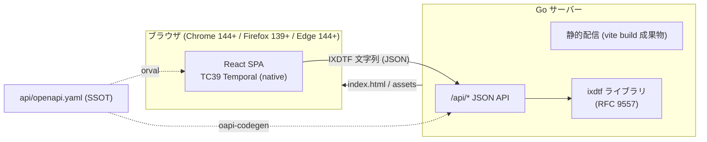
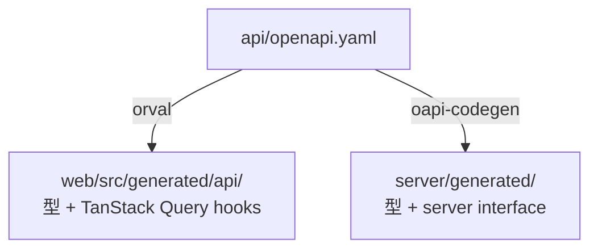
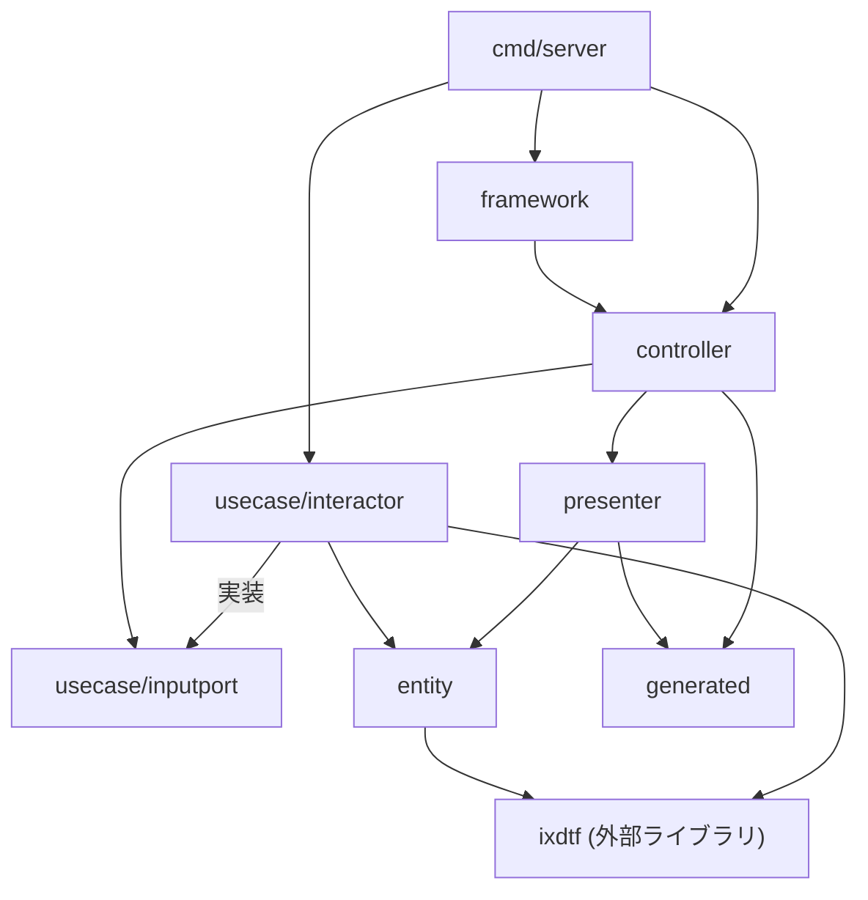
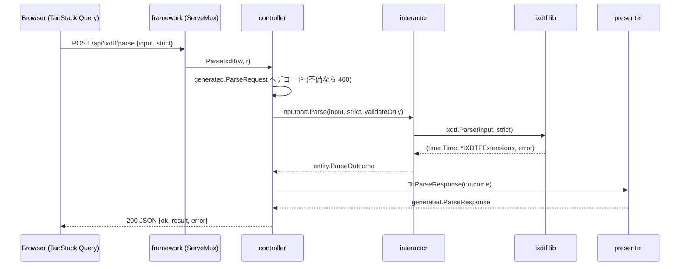

# IXDTF デモアプリケーション 設計書

機能要件は [requirements.md](./requirements.md) を参照。

## 技術スタック

| 領域            | 技術                                                                 |
| ------------- | ------------------------------------------------------------------ |
| バックエンド        | Go (net/http 標準ルーター) + [ixdtf](https://github.com/8beeeaaat/ixdtf) |
| フロントエンド       | React + Vite + TypeScript                                          |
| 日時処理 (ブラウザ)   | TC39 Temporal API ネイティブ実装 (**ポリフィル不使用**)                           |
| API 契約        | OpenAPI 3.1 (SSOT) → Orval (TS) / oapi-codegen (Go)                |
| データ取得         | TanStack Query (Orval 生成 hooks)                                    |
| フォーム          | TanStack Form                                                      |
| ルーティング        | TanStack Router (型付き search params を F-2-7 の共有 URL に利用)            |
| スタイリング        | Tailwind CSS v4 (@tailwindcss/vite)                                |
| i18n          | react-i18next (ja / en)                                            |
| Lint / Format | Biome (web)、golangci-lint (server)                                 |
| テスト           | Vitest、Storybook、Go table-driven tests                             |

## システム構成



デモの核は「**同じ IXDTF 文字列が、ブラウザのネイティブ Temporal と Go の ixdtf という
独立した 2 実装の間を行き来する**」こと。API ペイロードの日時値は常に IXDTF / RFC 3339
文字列または `unix_nano` (10 進文字列) で運び、両側で解析・整形する。

## リポジトリ構成 (モノレポ)

```text
ixdtf_demo/
├─ api/
│   └─ openapi.yaml          # API 契約の SSOT
├─ server/                   # Go バックエンド (Clean Architecture ライト)
│   ├─ go.mod                # module github.com/8beeeaaat/ixdtf_demo/server
│   ├─ cmd/server/main.go    # composition root
│   ├─ entity/
│   ├─ usecase/
│   │   ├─ inputport/
│   │   └─ interactor/
│   ├─ presenter/
│   ├─ controller/
│   ├─ framework/
│   └─ generated/            # oapi-codegen 出力 (git 管理)
├─ web/                      # React フロントエンド
│   ├─ orval.config.ts
│   └─ src/
├─ docs/
│   ├─ requirements.md
│   ├─ architecture.md
│   └─ DESIGN.md             # UI デザインシステム
└─ Makefile                  # generate / dev / test / lint / build
```

## スキーマ駆動開発

`api/openapi.yaml` を唯一の契約とし、両言語の型を生成する。手書きの API 型は禁止。



- OpenAPI 3.1 記法に従う: nullable は `type: ["string", "null"]`、レスポンスに `description: "OK"` 必須
- 生成物は git 管理し、CI で `make generate` 後の `git diff --exit-code` により乖離を検出する

## API 設計

エンドポイントは 4 つ。解析失敗は **HTTP 200 のドメイン結果** (`ok: false`) として返す
(要件 A-1: 不正な文字列を試すことがこのアプリの正常系のため)。4xx はリクエスト自体の不備のみ。

### スキーマ定義 (openapi.yaml 抜粋)

```yaml
openapi: 3.1.0
info:
  title: IXDTF Demo API
  version: 0.1.0
paths:
  /api/ixdtf/parse:
    post:
      operationId: parseIxdtf
      requestBody:
        required: true
        content:
          application/json:
            schema: { $ref: "#/components/schemas/ParseRequest" }
      responses:
        "200":
          description: "OK"
          content:
            application/json:
              schema: { $ref: "#/components/schemas/ParseResponse" }
        "400":
          description: "OK"
          content:
            application/json:
              schema: { $ref: "#/components/schemas/BadRequestError" }
  /api/ixdtf/format:
    post:
      operationId: formatIxdtf
      # FormatRequest → FormatResponse (構造は下記 components 参照)
  /api/ixdtf/roundtrip:
    post:
      operationId: roundtripIxdtf
      # RoundtripRequest → RoundtripResponse
  /api/now:
    get:
      operationId: getNow
      parameters:
        - { name: time_zone, in: query, schema: { type: string } }
        - { name: calendar,  in: query, schema: { type: string } }
      # → NowResponse

components:
  schemas:
    ParseRequest:
      type: object
      required: [input, strict]
      properties:
        input:  { type: string }
        strict: { type: boolean }
        validate_only: { type: boolean, default: false }   # F-2-6
    ExtensionTag:
      type: object
      required: [key, value, critical]
      properties:
        key:      { type: string }        # 例: "u-ca"
        value:    { type: string }        # 例: "japanese"
        critical: { type: boolean }       # "!" フラグ
    ParseResult:
      type: object
      required: [rfc3339, unix_nano, offset_seconds, time_zone, time_zone_critical, tags]
      properties:
        rfc3339:            { type: string }               # RFC3339Nano 表記
        unix_nano:          { type: string }               # int64 の 10 進文字列 (JS 精度対策)
        offset_seconds:     { type: integer }
        time_zone:          { type: ["string", "null"] }   # 例: "Asia/Tokyo"
        time_zone_critical: { type: boolean }
        tags:
          type: array
          items: { $ref: "#/components/schemas/ExtensionTag" }
    ParseError:
      type: object
      required: [message]
      properties:
        message: { type: string }   # ixdtf ライブラリのエラー原文 (要件 A-3)
    ParseResponse:
      type: object
      required: [ok, result, error]
      properties:
        ok:     { type: boolean }
        result: { oneOf: [{ $ref: "#/components/schemas/ParseResult" }, { type: "null" }] }
        error:  { oneOf: [{ $ref: "#/components/schemas/ParseError" },  { type: "null" }] }
    FormatRequest:
      type: object
      required: [unix_nano, extensions]
      properties:
        unix_nano: { type: string }
        extensions:
          type: object
          required: [time_zone, time_zone_critical, tags]
          properties:
            time_zone:          { type: ["string", "null"] }
            time_zone_critical: { type: boolean }
            tags:
              type: array
              items: { $ref: "#/components/schemas/ExtensionTag" }
    FormatResponse:
      type: object
      required: [ok, ixdtf, error]
      properties:
        ok:    { type: boolean }
        ixdtf: { type: ["string", "null"] }
        error: { oneOf: [{ $ref: "#/components/schemas/ParseError" }, { type: "null" }] }
    RoundtripRequest:
      type: object
      required: [input, strict]
      properties:
        input:  { type: string }
        strict: { type: boolean }
    RoundtripResponse:
      type: object
      required: [parse, formatted, lossless]
      properties:
        parse:     { $ref: "#/components/schemas/ParseResponse" }
        formatted: { type: ["string", "null"] }   # Parse 成功時のみ FormatNano の結果
        lossless:  { type: ["boolean", "null"] }  # formatted == input
    NowResponse:
      type: object
      required: [ixdtf, unix_nano]
      properties:
        ixdtf:     { type: string }
        unix_nano: { type: string }
    BadRequestError:
      type: object
      required: [message]
      properties:
        message: { type: string }
```

## Go サーバー設計 (Clean Architecture ライト)

DB を持たないため `model/` と `gateway/` は**設けない** (永続化が必要になった時点で追加する)。
ixdtf ライブラリはドメインロジックの中核として **interactor と entity からのみ**利用する。

### レイヤーと責務

| レイヤー               | パッケージ                       | 責務                                                                                                    |
| ------------------ | --------------------------- | ----------------------------------------------------------------------------------------------------- |
| entity             | `server/entity`             | ドメイン型 (`ParseOutcome`, `Extensions`, `ExtensionTag` 等)。ixdtf の型 (`*ixdtf.IXDTFExtensions`) との双方向変換を持つ |
| usecase/inputport  | `server/usecase/inputport`  | `IxdtfInputPort` インターフェース (controller が依存する契約)                                                        |
| usecase/interactor | `server/usecase/interactor` | `ixdtf.Parse` / `FormatNano` の呼び出しとドメイン判断 (strict、validate_only、lossless 判定)                          |
| presenter          | `server/presenter`          | entity → generated レスポンス型への変換 (unix_nano の文字列化等)                                                      |
| controller         | `server/controller`         | HTTP ハンドラ。JSON デコード → inputport 呼び出し → presenter → JSON エンコード                                         |
| framework          | `server/framework`          | `http.ServeMux` ルーティング + 静的ファイル配信 (`go:embed` した vite build 成果物)                                      |
| generated          | `server/generated`          | oapi-codegen 出力 (リクエスト / レスポンス型)                                                                      |
| composition root   | `server/cmd/server`         | interactor 生成 → controller へ注入 → framework 起動                                                         |

### 依存方向



### インターフェース定義 (inputport)

```go
// server/usecase/inputport/ixdtf.go
type IxdtfInputPort interface {
    Parse(input string, strict bool, validateOnly bool) entity.ParseOutcome
    Format(unixNano int64, ext entity.Extensions) entity.FormatOutcome
    Roundtrip(input string, strict bool) entity.RoundtripOutcome
    Now(timeZone string, calendar string) (entity.FormattedNow, error)
}
```

解析失敗は `ParseOutcome.Err` に保持する (Go の `error` 戻り値にしない)。
ドメイン上の正常系だからであり、controller が 200/4xx を選り分ける分岐を持たずに済む。

### リクエスト処理フロー (parse の例)



## フロントエンド設計

### ディレクトリ構成

```text
web/src/
├─ main.tsx                  # Temporal feature detection → App or UnsupportedBrowser
├─ index.css                 # Tailwind エントリ (@import "tailwindcss" + @theme トークン)
├─ app/
│   ├─ router.tsx            # TanStack Router (5 ルート)
│   ├─ providers.tsx         # QueryClient / i18n / theme
│   └─ i18n.ts
├─ pages/
│   ├─ home/                 # F-1: ClockCard, IxdtfDisplay, MonthCalendar, ServerNowCard
│   ├─ playground/           # F-2: IxdtfForm (TanStack Form), ResultPanel, BrowserResultPanel
│   ├─ interop/              # F-3: RoundtripForm, ComparisonTable, PresetList
│   ├─ converter/            # F-4: WorldClockList, TimeZoneAdder, CalendarSwitch
│   └─ guide/                # F-5: GuideContent, SampleGallery
├─ components/               # 横断: IxdtfHighlight, TimeZonePicker, CalendarPicker,
│                            #       CopyButton, StrictToggle
├─ lib/
│   ├─ ixdtf/tokenize.ts     # IXDTF 文字列のトークン分解 (ハイライト用、純関数)
│   └─ temporal/
│       ├─ detect.ts         # globalThis.Temporal の存在検出
│       └─ browserParse.ts   # ZonedDateTime.from → 失敗時 Instant.from フォールバック
├─ generated/api/            # Orval 出力 (型 + TanStack Query hooks、git 管理)
└─ locales/
    ├─ ja/translation.json
    └─ en/translation.json
```

各ページコンポーネントには `*.stories.tsx` (Storybook) と `*.test.tsx` (Vitest) を同居させる。

### 状態管理の方針

| 状態                      | 置き場所                                                |
| ----------------------- | --------------------------------------------------- |
| サーバー応答 (parse 結果等)      | TanStack Query (Orval 生成 hooks)                     |
| Playground の入力 / strict | TanStack Router の型付き search params (共有 URL = F-2-7) |
| Converter のタイムゾーン一覧     | localStorage (カスタム hook で同期)                        |
| 現在時刻 (1 秒 tick)         | `useNow()` hook。購読コンポーネントを ClockCard 内に限定 (N-4)     |
| テーマ / 言語                | React context + localStorage                        |

### ブラウザ側 Temporal の利用ポイント

- `Temporal.Now.zonedDateTimeISO(tz)` — F-1 時計
- `Temporal.ZonedDateTime.from(input)` — F-2 / F-3 のブラウザ側解析。
`[TZ]` 注釈のない RFC 3339 文字列は `ZonedDateTime.from` では解析できないため、
失敗時は `Temporal.Instant.from` にフォールバックし、どちらの API で解析できたかも表示する
- `.withTimeZone()` / `.withCalendar()` — F-4 変換
- `Temporal.PlainYearMonth` — F-1 月間カレンダー描画
- `Intl.supportedValuesOf("timeZone" | "calendar")` — 選択肢の列挙

### IXDTF トークナイザ (`lib/ixdtf/tokenize.ts`)

ハイライト表示 (F-1-2, F-2-5) 用にクライアント側で文字列を
`date` / `time` / `offset` / `timezone` / `extension` トークンへ分解する純関数。
**表示専用**であり、正当性の判定は常にサーバー (ixdtf) とブラウザ (Temporal) の解析結果を使う。
規格の解釈ロジックを 3 つ目に増やさないための線引き。

### スタイリング (Tailwind CSS)

デザインシステムの詳細 (トークン定義・コンポーネント規約・禁止パターン) は
[DESIGN.md](./DESIGN.md) を参照。要点:

- ビジュアルの方向性は**タイポグラフィ・ミニマル**: 白/黒基調・大きな余白・等幅フォントで
  IXDTF 文字列そのものを主役に置き、構成要素の色分けは控えめに添える
- Tailwind CSS v4 を `@tailwindcss/vite` プラグインで導入する (PostCSS 設定は不要)
- デザイントークンは `index.css` の `@theme` で CSS 変数として定義する。特に IXDTF ハイライト
  (F-1-2, F-2-5) の色は `tokenize.ts` のトークン種別 (`date` / `time` / `offset` / `timezone` /
  `extension`) と 1:1 対応するトークン名で持ち、両画面で共有する
- ダークモード (F-0-3): セマンティックトークンの CSS 変数を `prefers-color-scheme` と `<html>` の
  `.dark` / `.light` クラスの両方で切り替える (auto / light / dark の 3 状態を localStorage に保存)。
  コンポーネント側で `dark:` バリアントは使わない
- クラス順序は Biome の `useSortedClasses` ルールで統一する
- Storybook にも `index.css` を読み込み、アプリと同一のトークンで描画する
- 見た目のコンポーネントライブラリは追加しない。アクセシビリティ挙動のみ Radix UI primitives
  (Tooltip / Select / Switch) を利用できる (スタイルは常に自作)

## 主要設計判断

| #   | 判断                                         | 理由                                                                 |
| --- | ------------------------------------------ | ------------------------------------------------------------------ |
| D-1 | 解析失敗を HTTP 200 のドメイン結果で返す                  | 不正入力の観察がデモの目的。エラーハンドリングを UI の分岐 (ok フラグ) に一本化                      |
| D-2 | ポリフィル不使用 + feature detection ゲート           | ネイティブ実装のショーケースであることを優先。非対応環境は案内画面 (F-0-4)                          |
| D-3 | `unix_nano` を 10 進文字列で運ぶ                   | int64 は JS の `Number.MAX_SAFE_INTEGER` を超えるため                      |
| D-4 | 拡張タグを map でなく順序付き配列 (`ExtensionTag[]`) で運ぶ | 表表示の安定性と、`!` critical フラグをタグ単位で持たせるため                              |
| D-5 | ルーターに TanStack Router を採用                  | F-2-7 の共有 URL を型付き search params で実装できる。TanStack Query / Form との整合 |
| D-6 | `model/` `gateway/` レイヤーを作らない              | DB が無い。使わないレイヤーの器だけ作ることはしない (必要になったら追加)                            |
| D-7 | 静的配信は `go:embed`                           | 単一バイナリで配布できるデモにする。開発時は Vite dev server + `/api` プロキシ               |
| D-8 | スタイリングは Tailwind CSS v4 (ユーティリティファースト)      | テーマ切替 (F-0-3) をセマンティックトークンの自動切替で、IXDTF ハイライト色を `@theme` トークンで一元管理できる ([DESIGN.md](./DESIGN.md))    |

## テスト戦略

| 対象                          | 手法                                                                 |
| --------------------------- | ------------------------------------------------------------------ |
| `server/usecase/interactor` | table-driven test (正常 / strict 不整合 / critical 拒否 / private 拡張拒否)   |
| `server/presenter`          | entity → generated 変換の table-driven test (unix_nano 文字列化、null 変換)  |
| `server/controller`         | `httptest` による JSON in/out (400 系の境界含む)                            |
| `web/lib/ixdtf/tokenize`    | Vitest 純関数テスト (要件 F-1-2 の分類網羅)                                     |
| ページ / コンポーネント               | Storybook stories + interaction test (Temporal 非対応表示は detect をモック) |
| API 契約                      | `make generate` → `git diff --exit-code` (生成物の乖離検出、N-5)            |

## 開発ワークフロー

```text
make generate   # orval + oapi-codegen (openapi.yaml 変更時)
make dev        # go run ./server/cmd/server + vite dev (/api は Vite proxy で :8080 へ)
make test       # go test ./server/... + vitest run
make lint       # golangci-lint + biome check
make build      # vite build → server/framework へ embed → go build (単一バイナリ)
```

## リスクと対応

| リスク                                   | 対応                                                                                                                                                       |
| ------------------------------------- | -------------------------------------------------------------------------------------------------------------------------------------------------------- |
| oapi-codegen の OpenAPI 3.1 対応が不完全な可能性 | スキーマは 3.1 記法を保ちつつ 3.0 互換のサブセット (webhooks 等を使わない) に留める。それでも生成不能な場合は、API 面が 4 エンドポイントと小さいため `server/generated` を手書きし、スキーマとの一致を contract test で担保する代替に切り替える |
| Edge の Temporal が experimental 段階     | feature detection (F-0-4) で実行時に判定するため、対応表の更新のみで追従できる                                                                                                     |
| ブラウザと ixdtf の解析結果が想定外に一致しない           | それ自体を F-3 の展示物として扱う (バグではなく仕様差として明示する)                                                                                                                   |

## 決定済みの補足事項 (2026-07-07 確定)

1. **ビジュアルデザインの方向性** — タイポグラフィ・ミニマル (詳細は「スタイリング」節)
2. **F-5 サンプル文字列集** — RFC 9557 本文の例 + 代表的な落とし穴から 10〜15 個に厳選
   ([requirements.md](./requirements.md) F-5-2)
3. **Go module path** — `github.com/8beeeaaat/ixdtf_demo/server` (`server/go.mod`)
